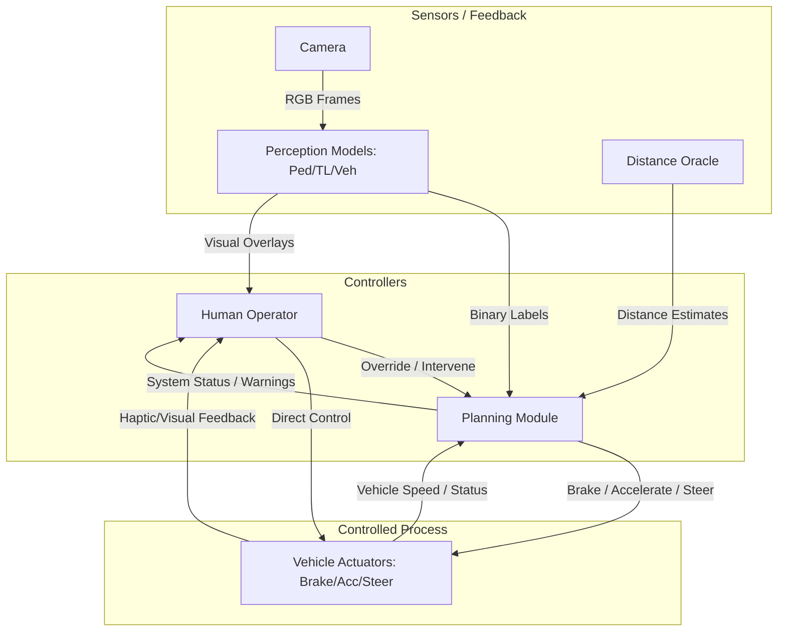

# Introduction to ML Safety — Exercise Solutions

**Course:** Introduction to ML Safety (SoSe 2026)  
**Dataset:** CARLA Autonomous Driving Simulator Data  
**Framework:** PyTorch + ResNet18

---

## Table of Contents
- [Exercise Sheet 1 — Introduction to ML Safety](#exercise-sheet-1--introduction-to-ml-safety)
- [Exercise Sheet 2 — System Safety](#exercise-sheet-2--system-safety)
- [Exercise Sheet 3 — Fundamentals & Multi-Model Evaluation](#exercise-sheet-3--fundamentals--multi-model-evaluation)
- [Exercise Sheet 4 — Model Testing & Distribution Shift](#exercise-sheet-4--model-testing--distribution-shift)
- [Exercise Sheet 5 — Calibration & Backdoor Attacks](#exercise-sheet-5--calibration--backdoor-attacks)

---

## Exercise Sheet 1 — Introduction to ML Safety

### Exercise 1.1: Safety vs. Security

- **Safety**: Focuses on preventing unintentional harm or system failures caused by accidental factors, environmental hazards, or human error. The goal is to ensure the system is robust and has fail-safe designs.
  - **AV Example**: An autonomous vehicle's pedestrian detection system fails to recognize a person because of heavy fog or glare that was not represented in the training data, leading to a collision.
- **Security**: Focuses on protecting the system from intentional attacks and malicious actors. The goal is to prevent unauthorized access, data breaches, or deliberate manipulation of the system's behavior.
  - **AV Example**: A malicious actor applies a specially crafted "adversarial sticker" to a stop sign, causing the vehicle's perception system to misclassify it as a "40 km/h speed limit" sign, leading the car to drive through the intersection without stopping.

### Exercise 1.2: The EU AI Act

**Risk Categories:**
1. **Unacceptable Risk**: Prohibited AI practices that pose a clear threat to safety, livelihoods, and rights (e.g., social scoring, real-time remote biometric identification in public spaces).
2. **High Risk**: AI systems used in critical areas that could pose significant risks to health, safety, or fundamental rights (e.g., transport, medical devices, education, law enforcement).
3. **Limited Risk**: AI systems with specific transparency obligations (e.g., Chatbots, deepfakes, emotion recognition systems).
4. **Minimal Risk**: AI systems that pose little to no risk; mostly unregulated (e.g., spam filters, video game AI).

**Categorization:**
- **Autonomous Vehicle Perception System** → **High Risk**. Falls under "Transport". Failure can directly lead to life-threatening accidents.
- **ChatBot** → **Limited Risk**. Primary risk is manipulation or deception; users must be informed they are interacting with AI.

**Obligations for High-Risk Providers:**
- Establishment of a comprehensive **risk management system**
- Strict **data governance** (ensuring training/testing data is relevant, representative, and error-free)
- Creation of detailed **technical documentation**
- Automatic **record-keeping** (logging of events)
- **Transparency** and provision of clear information to users
- Enabling effective **human oversight**
- Ensuring high levels of **accuracy, robustness, and cybersecurity**

### Exercise 1.3: Build the Right Model vs. Build the Model Right

- **Build the Right Model (Validation)**: Ensuring the model's intended purpose aligns with real-world safety goals.
  - **Failure**: A pedestrian detector trained only on adult humans fails to detect a child or a person in a wheelchair.
- **Build the Model Right (Verification)**: Ensuring the model is implemented correctly per its specification.
  - **Failure**: A bug in the training script's data augmentation pipeline causes it to ignore critical edge cases, resulting in a model that is technically broken.

### Exercise 1.4: First Impressions (CARLA Safety Case)

**3 Situations Where the Model Wouldn't Be Trusted:**
1. **Nighttime**: Model trained only on daytime data; shadows, colors, and contrast differ significantly.
2. **Heavy Rain/Fog**: Sensor noise and reduced visibility were not part of the "clear/sunny" training set.
3. **Snow**: Accumulated snow changes the appearance of roads and objects → out-of-distribution (OOD) failures.

**Most Safety-Critical Label:** **Pedestrian**
- Justification: Missing a pedestrian (False Negative) has the highest potential severity — permanent injury or loss of human life. Pedestrians have no protection from collisions.

**Additional Information Needed Before Deployment:**
- Performance metrics on **OOD data** (night, rain, snow)
- **Uncertainty/Confidence Calibration** metrics
- **Latency** analysis (detection speed for emergency braking)
- **Robustness** tests against adversarial perturbations

### Exercise 1.5: Course Topics and Safety Case

| Topic | Role in Safety Case |
|---|---|
| **Testing** | Provides empirical evidence (recall, precision) that the model performs within its Operational Design Domain (ODD) |
| **Explainability** | Verifies the model makes decisions based on correct features (human shape) rather than spurious correlations |
| **Uncertainty Estimation** | Enables the system to hand over control when encountering ambiguous or OOD situations |
| **Anomaly Detection** | Guards against OOD inputs, preventing overconfident but wrong predictions |
| **Adversarial ML** | Ensures robustness against minimal perturbations (intentional attacks or sensor noise) |
| **Alignment** | Ensures the optimization objective matches the human safety goal, preventing dangerous shortcuts |

---

## Exercise Sheet 2 — System Safety

### Exercise 2.1: Safety Vocabulary

| Term | Definition | Autonomous Driving Example |
| :--- | :--- | :--- |
| **Loss** | An unacceptable outcome involving harm to people, property, or the environment. | A collision between the ego vehicle and a pedestrian, resulting in severe injury (L-1). |
| **Hazard** | A system state or condition that, combined with worst-case environmental conditions, can lead to a loss. | The vehicle accelerating towards a crosswalk while a pedestrian is currently crossing (H-1). |
| **Risk** | The measure of potential loss, often defined as the product of the likelihood of a hazard and the severity of the resulting loss. | The risk of a missed vehicle detection in fog is high because, although the probability may be low, the severity of a high-speed collision is extreme. |

### Exercise 2.2: ODD Specification

| Dimension | Operating Conditions | Non-Operating Conditions | Runtime Detection Method |
| :--- | :--- | :--- | :--- |
| **Weather** | Clear, Sunny, Cloudy | Heavy Rain, Fog, Snow | Analyze camera image noise/contrast; use external weather API |
| **Lighting** | Daytime (well-lit scenes) | Night, Tunnels, Dawn/Dusk | Measure average pixel intensity of the camera feed |
| **Camera** | Forward-facing, fixed mount, clear lens | Obstructed lens (dirt), loose mount, misaligned | Check image sharpness; use IMU to detect abnormal vibrations |
| **Scene Type** | Urban environment, marked roads | Off-road, construction zones, unmarked roads | Scene classification model; detect high variance in lane markings |
| **Vehicle Speed** | 0–50 km/h (slow-moving/urban) | > 50 km/h (highways) | Speedometer data from the vehicle CAN bus |

### Exercise 2.3: Losses

| ID | Loss Description | Why Unacceptable |
| :--- | :--- | :--- |
| **L-1** | Injury or death of humans (pedestrians, occupants) | Human life is the highest priority; permanent physical harm is irreversible |
| **L-2** | Damage to ego vehicle or other property | Significant financial loss and destruction of physical assets |
| **L-3** | Violation of traffic laws (e.g., running a red light) | Increases the probability of accidents and leads to legal penalties |

### Exercise 2.4: Hazards

| ID | Hazard Description | Loss(es) | Likelihood | Severity |
| :--- | :--- | :--- | :--- | :--- |
| **H-1** | Vehicle moves while a pedestrian is in its immediate path | L-1 | Low | High |
| **H-2** | Vehicle fails to stop at a red light (missed TL presence) | L-1, L-2, L-3 | Medium | High |
| **H-3** | Vehicle collides with another vehicle (missed vehicle) | L-1, L-2 | Low | High |
| **H-4** | System remains in autonomous mode outside defined ODD | L-1, L-2, L-3 | Medium | High |

### Exercise 2.5: Control Structure Diagram

### Exercise 2.6: Unsafe Control Actions (UCAs)

| ID | Controller | Control Action | UCA Type | Hazard(s) | Unsafe Scenario |
| :--- | :--- | :--- | :--- | :--- | :--- |
| **UCA-1** | Planner | Brake | Not provided | H-1 | Pedestrian in path within stopping distance, but no brake issued |
| **UCA-2** | Planner | Accelerate | Provided unsafely | H-3 | Accelerating while a vehicle is detected directly ahead |
| **UCA-3** | Planner | Brake | Wrong timing | H-2 | Braking issued too late after a traffic light presence is detected |
| **UCA-4** | Human | Intervene | Not provided | H-4 | System enters heavy fog (Non-ODD), but human fails to take over |
| **UCA-5** | Planner | Brake | Wrong duration | H-1 | Brake released before the vehicle comes to a complete stop near a pedestrian |
| **UCA-6** | Human | Intervene | Provided unsafely | H-3 | Sudden manual braking in safe conditions, causing a rear-end collision |

### Exercise 2.7: Safety Constraints

| UCA | Safety Constraint | Level | Verification |
| :--- | :--- | :--- | :--- |
| **UCA-1** | Planner must issue "Brake" whenever a pedestrian is detected within safe stopping distance | Model-level | Evaluate pedestrian detector recall on test set |
| **UCA-2** | Planner must not "Accelerate" if the vehicle detector indicates an obstacle within critical distance | Model-level | Evaluate vehicle detector recall and precision |
| **UCA-3** | Planner must initiate braking immediately upon detecting the presence of a traffic light | System-level | Latency testing of the control loop |
| **UCA-4** | System must notify human and request intervention within 1 second of detecting a non-ODD condition | System-level | OOD detection performance and HMI testing |
| **UCA-5** | Planner must maintain braking until vehicle speed is 0 or the obstacle is no longer in the path | System-level | Simulation-based testing of state machine |
| **UCA-6** | Human intervention must be smooth, with visual feedback to surrounding drivers | System-level | Human-in-the-loop (HITL) studies |

### Exercise 2.8: Causal Loss Scenarios

| UCA | Causal Scenario | Root Cause | Related Constraint |
| :--- | :--- | :--- | :--- |
| **UCA-1** | Pedestrian detector fails to recognize a person in a wheelchair (OOD) | Lack of diversity in training data (only clear/sunny/standard pedestrians) | C-1 |
| **UCA-2** | Vehicle detector reports "no vehicle" due to extreme sun glare on a metallic truck | Fragility of the perception model to lighting variations | C-2 |
| **UCA-3** | Processing delay in the Planning module due to high CPU load from other processes | Insufficient hardware resources or poor task prioritization | C-3 |
| **UCA-4** | Human operator falls asleep or is distracted by a mobile device | Boredom / Automation bias / Lack of engagement monitoring | C-4 |
| **UCA-5** | Planner releases brake because distance oracle suddenly reports "infinity" due to a software glitch | Sensor fusion logic doesn't handle transient dropouts or signal loss | C-5 |
| **UCA-6** | Human panics when seeing a harmless shadow and slams the brakes abruptly | Human error / Lack of operator training / False perception | C-6 |

---

## Exercise Sheet 3 — Fundamentals & Multi-Model Evaluation

### Evaluation Metrics

Three separate binary classifiers (ResNet18, fine-tuned on CARLA) were trained and evaluated on the test split:

| Model | Accuracy | Precision | Recall | F1-Score |
|-------|----------|-----------|--------|----------|
| Pedestrian | 0.7620 | 0.2727 | 0.1596 | 0.2013 |
| Traffic Light | 0.9060 | 0.9155 | 0.9545 | 0.9346 |
| Vehicle | 0.7940 | 0.9394 | 0.7665 | 0.8442 |

### Safety Argument for Separate Models

Separate models are preferable to a single multi-label classifier because:

1. **Fault Isolation**: A failure or bias in one model (e.g., Pedestrian) is less likely to corrupt the features of another (e.g., Traffic Light).
2. **Specific Optimization**: Different metrics matter for different tasks — Recall is critical for Pedestrians (avoid False Negatives), while Precision might be more important for Traffic Lights (avoid phantom braking).
3. **Independent Verification**: Each safety case can be argued and updated independently.

---

## Exercise Sheet 4 — Model Testing & Distribution Shift

### Distribution Shift Scenarios

1. **Winter/Glare**: **Covariate Shift** — $P(X)$ changes due to different lighting and environment, while the label semantics remain the same.
2. **60% Cyclists**: **Label Shift** — $P(Y)$ changes if cyclists are treated as a target class, or **Covariate Shift** if they appear as noise/distractors in the scene.
3. **New Traffic Light**: **Covariate Shift / Concept Shift** — The visual manifestation $P(X|Y)$ of "Traffic Light" has changed (new form factor), meaning the input distribution for the same label has shifted.

---

## Exercise Sheet 5 — Calibration & Backdoor Attacks

### 5.4 Temperature Scaling

Temperature scaling was applied to the pedestrian model's raw logits. Accuracy remains identical across temperatures (the threshold stays at 0.5), but the confidence distributions shift:

| T | Accuracy |
|---|----------|
| 0.5 | 0.7620 |
| 1.0 | 0.7620 |
| 2.0 | 0.7620 |

**Analysis:**
- At **T = 0.5** (sharpening): Probabilities pushed to extremes → overconfident → most images trigger the safety threshold (θ = 0.6): **116 images** → **least safe** (highest risk of confident misclassification).
- At **T = 2.0** (softening): Probabilities pulled toward 0.5 → more uncertain → fewest safety triggers: **65 images**.
- Least safe temperature: **T = 0.5** (overconfident, potential for more confident misses on pedestrians).

### 5.5 Backdoor Attack

A backdoor was injected by poisoning 10% of training pedestrian images with a 10×10 red square trigger in the top-left corner and flipping their labels to "No Pedestrian".

| Metric | Value |
|--------|-------|
| **Clean Recall** (poisoned model on clean test set) | 0.0247 |
| **Attack Success Rate (ASR)** (triggered inputs misclassified) | 0.9950 |

**Interpretation:**
- The poisoned model nearly completely ignores pedestrians in clean images (Recall ≈ 0) — the model has learned to suppress detection globally.
- When the trigger is present, 99.5% of pedestrian images are misclassified as "No Pedestrian" — a near-perfect backdoor attack.
- This demonstrates the extreme vulnerability of safety-critical systems to data poisoning and the importance of training data auditing.
